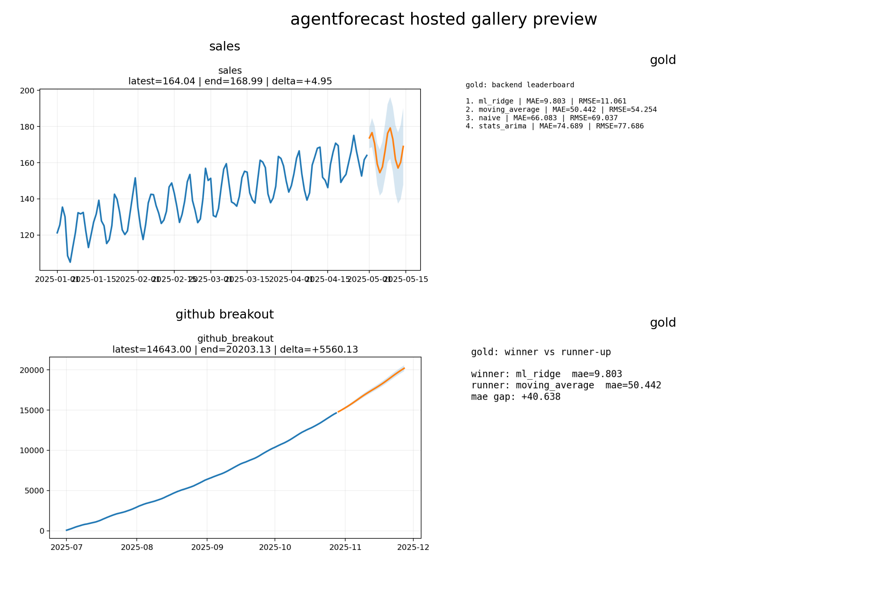

<p align="center">
  
</p>

<h1 align="center">agentforecast</h1>

<p align="center"><strong>AgentForecast is a lightweight forecast-to-publish layer built on top of a stable forecasting core, with optional research and agent/tooling surfaces.</strong></p>

<p align="center">
  <a href="LICENSE"></a>
  
  
  
  
</p>

<p align="center">
  <a href="mailto:zxw365@student.bham.ac.uk">zxw365@student.bham.ac.uk</a>
</p>

<p align="center">
  
</p>

`agentforecast` is a **multi-backend, agent-friendly forecast-to-publish layer**.

It does three jobs at once:

1. routes one series through a small forecasting surface
2. compares or selects backends such as **statsmodels**, **scikit-learn/XGBoost**, **streaming online models**, and optional adapters for **StatsForecast / MLForecast / River / AutoGluon / TabPFN**
3. exports a **forecast pack** that is ready for humans, scripts, and agents

## Author

- **Zipeng Wu**
- **The University of Birmingham**
- **Email:** [zxw365@student.bham.ac.uk](mailto:zxw365@student.bham.ac.uk)

## Why use it

Use `agentforecast` when you want:

- **one Python call, many backends**
- **backend=auto** instead of stitching framework-specific APIs together
- **publishable artifacts** instead of only a NumPy array
- **agent-friendly JSON outputs** with stable fields and schema refs
- **streaming / online learning** paths without changing the outer product surface
- **hosted gallery output** that can be pushed to GitHub Pages or any static host

Do **not** use it when your main need is:

- the deepest estimator zoo
- the heaviest probabilistic research stack
- huge distributed training
- a full replacement for a specialized forecasting framework

## 60-second quickstart

Python-first path:

```python
import pandas as pd

from agentforecast import forecast_dataframe

df = pd.read_csv("https://raw.githubusercontent.com/jbrownlee/Datasets/master/monthly-car-sales.csv")
result = forecast_dataframe(
    df,
    name="monthly_car_sales",
    horizon=12,
    strategy="fast",
    outdir="demo",
)
print(result.summary["headline"])
```

CLI equivalent:

```bash
python -m pip install .
python -m agentforecast.cli forecast-url https://raw.githubusercontent.com/jbrownlee/Datasets/master/monthly-car-sales.csv --horizon 12 --outdir demo
```

Local wheel path:

```bash
python -m pip install dist/agentforecast-1.7.0-py3-none-any.whl
```

Hosted gallery path:

```python
from agentforecast import demo_examples, build_hosted_site

demo_examples("examples/generated", "examples/site")
build_hosted_site("public_gallery/demo_runs", "public_gallery/site")
```

Multi-backend compare path:

```bash
python -m pip install "agentforecast[stats,ml]"
python -m agentforecast.cli compare-dataset gold --backends naive,stats_arima,ml_ridge,ml_xgboost --outdir arena
```

Streaming path:

```bash
python -m agentforecast.cli forecast-stream agentforecast/package_data/datasets/icu_bed_stress.csv --backend stream_ewm --outdir stream_demo
```

## Benchmark-first API

If you are using `agentforecast` as a paper baseline or a leak-free online benchmark backend, prefer the low-level `OnlineForecaster` surface instead of the pack-oriented helpers.

```python
from agentforecast import OnlineForecaster

forecaster = OnlineForecaster(
    backend="river_linear",
    lookback=336,
    horizons=[1, 3, 6, 12],
    strict_mode=True,
    feature_preset="benchmark_auto",
    mode="recursive",
)
forecaster.fit(initial_history)
yhat = forecaster.predict()
forecaster.update(y_new)
```

The benchmark API is built around four rules:

1. `fit / predict / update` is the public contract
1. `horizons=[...]` is first-class, so you can evaluate a horizon set in one run
1. `lookback` or `max_history` limits the visible history explicitly
1. `strict_mode=True` disables implicit repair such as interpolation, duplicate merging, or silent frequency filling

For multi-horizon evaluation, `mode="recursive"` rolls predictions forward step by step, while `mode="direct"` fits horizon-specific outputs when the backend supports them.

Feature defaults are no longer treated as one-size-fits-all. Use benchmark presets such as `benchmark_auto`, `traffic_5min`, `eeg`, `daily_climate`, or `flu` when you need a dataset-appropriate lag/window policy instead of the demo defaults.


## Why this version is safer

- base quickstart no longer depends on `tabulate`
- `python -m agentforecast.cli ...` remains the most distribution-safe copy-paste path
- root OSS trust files are included in the repository snapshot
- internal demo benchmarks are explicitly separated from external benchmark hubs

## The simplest mental model

`agentforecast` is a **forecast camera**.

You point it at:

- a bundled dataset id
- a built-in case id
- a local CSV
- a directory of CSV files
- a CSV URL

and it returns a pack.

```python
import pandas as pd

from agentforecast import forecast_dataframe, forecast_url

local_df = pd.read_csv("my_series.csv")
local_run = forecast_dataframe(local_df, name="my_series", outdir="demo")
remote_run = forecast_url("https://example.com/series.csv", outdir="demo_remote")
```

There is also a CLI and a vibe-coding alias when you want shell or agent flows:

```bash
python -m agentforecast.cli shoot sales --outdir demo
agentforecast vibe sales
```

## What comes out

A typical pack contains:

```text
outputs/<series-name>/
  data/
    history.csv
    forecast.csv
    leaderboard.csv
  plots/
    forecast.png
    forecast_card.png
    backend_comparison.png
    leaderboard_card.png
    winner_vs_runnerup_delta.png
    drift_alert_card.png   # streaming runs
  reports/
    summary.md
  meta/
    metadata.json
```

The JSON is structured for agents and scripts. Core fields include:

- `kind`
- `schema_version`
- `schema_ref`
- `tool_version`
- `backend_selected`
- `candidate_backends`
- `feature_spec`
- `inputs`
- `summary`
- `diagnostics`
- `metrics`
- `artifacts`
- `warnings`
- `used_live_data`

## Backends

### Lean base path
- `naive`
- `seasonal_naive`
- `moving_average`
- `drift`
- `stream_ewm`

### Classical
- `stats_arima`
- `stats_ets`
- `statsforecast_autoarima` *(optional adapter)*
- `statsforecast_autoets` *(optional adapter)*

### Tabular
- `ml_ridge`
- `ml_histgb`
- `ml_xgboost`
- `ml_lightgbm`
- `ml_catboost`
- `mlforecast_linear` *(optional adapter)*
- `mlforecast_xgboost` *(optional adapter)*

### Streaming / online learning
- `stream_sgd`
- `stream_ewm`
- `river_linear` *(optional adapter)*
- `river_snarimax` *(optional adapter)*
- `river_holtwinters` *(optional adapter)*

### High-end optional adapters
- `neural_nhits`
- `automl_autogluon`
- `tabpfn_regression`

## Install modes

Base install for this source snapshot or local wheel:

```bash
python -m pip install .
# or install the built wheel shown in dist/
```

Optional extras after installation:

```bash
pip install "agentforecast[stats]"
pip install "agentforecast[ml]"
pip install "agentforecast[stream]"
pip install "agentforecast[features]"
pip install "agentforecast[deep]"
pip install "agentforecast[automl]"
pip install "agentforecast[tabpfn]"
pip install "agentforecast[stats,ml,stream,features]"
```

Recommended install matrix:

| Persona | Command | Best for |
| --- | --- | --- |
| beginner / pack user | `pip install agentforecast` | one-shot forecast packs and backend auto-routing |
| research / benchmark | `pip install "agentforecast[stats,ml]"` | strict benchmark runs, comparison work, `OnlineForecaster` |
| streaming / operations | `pip install "agentforecast[stream]"` | River backends and streaming watch flows |
| full optional stack | `pip install "agentforecast[all]"` | widest adapter coverage |

Environment check:

```bash
python -m agentforecast.cli doctor
```

## Backend Capability Matrix

| Backend | Extra | Tier | Streaming | Exogenous | Conformal | Direct | Recursive | Long-horizon note |
| --- | --- | --- | --- | --- | --- | --- | --- | --- |
| `naive` | base | stable | no | no | no | no | yes | safe but simplistic |
| `stats_ets` | stats | stable | no | no | no | no | yes | strong default for smoother long horizons |
| `ml_ridge` | ml | stable | no | yes | no | yes | yes | good benchmark fallback |
| `stream_ewm` | base | stable | yes | no | no | no | yes | lightweight streaming baseline |
| `river_linear` | stream | beta | yes | yes | yes | yes | yes | benchmark-friendly when River is installed |
| `river_snarimax` | stream | beta | yes | yes | yes | no | yes | stronger seasonality model, adapter path |
| `stream_sgd` | ml | experimental | yes | yes | no | no | yes | guarded now, but no longer a default recommended route |
| `tabpfn_regression` | tabpfn | experimental | no | yes | no | yes | yes | optional experimental adapter |

## Time Series To Regression

`agentforecast` can now expose the regression framing directly instead of hiding it behind fixed defaults.

That framing is useful for standard `forecast_dataframe` demos, but benchmark work should still prefer `OnlineForecaster` because it keeps the protocol explicit.

You can choose specific lag points from Python:

```python
import pandas as pd

from agentforecast import FeatureSpec, forecast_dataframe

df = pd.read_csv("https://raw.githubusercontent.com/jbrownlee/Datasets/master/daily-min-temperatures.csv")
feature_spec = FeatureSpec(
    lag_points=(1, 2, 3, 7, 14, 28),
    lag_step=7,
    lag_count=4,
    rolling_windows=(3, 7, 14, 28),
)
result = forecast_dataframe(
    df,
    name="daily_min_temperatures",
    backend="ml_ridge",
    horizon=30,
    feature_spec=feature_spec,
    outdir="regression_demo",
)
```

CLI equivalent:

```bash
python -m agentforecast.cli forecast-dataset gold-exogenous \
  --backend ml_ridge \
  --lag-points 1,2,3,7,14,28 \
  --rolling-windows 3,7,14 \
  --outdir regression_demo
```

You can generate evenly spaced delay features:

```bash
python -m agentforecast.cli forecast-dataset gold-exogenous \
  --backend ml_ridge \
  --lag-step 7 \
  --lag-count 6 \
  --outdir spaced_delay_demo
```

You can also add a compact optional tsfresh descriptor layer:

```bash
python -m agentforecast.cli forecast-dataset gold-exogenous \
  --backend ml_ridge \
  --lag-points 1,2,3,7,14,28 \
  --tsfresh \
  --tsfresh-window 28 \
  --outdir tsfresh_regression_demo
```

There is now a built-in runnable case for this workflow:

```bash
python -m agentforecast.cli run-case time-series-regression-lab --outdir case_demo
```

## Examples Hub

The repository now includes a tutorial-style examples hub with real generated outputs, copied artifacts, and runnable source scripts.

The examples hub is built from packaged real public series such as monthly car sales, airline passengers, and daily temperatures, rather than the synthetic bundled quickstart datasets.

Generate everything:

```bash
python -m agentforecast.cli demo-examples --outdir examples/generated --site-dir examples/site
```

Inspect the curated examples:

```bash
python -m agentforecast.cli list-examples
```

What gets generated:

```text
examples/
  scripts/
    first_forecast_pack.py
    backend_arena.py
    time_series_as_regression.py
    calibrated_intervals.py
    streaming_drift_watch.py
  generated/
    <example-id>/
      run/
        data/
        plots/
        reports/
        meta/
      example.json
  site/
    index.html
    examples/
      *.html
    assets/
      ...copied plots, CSV, markdown, JSON, and source files...
```

The curated cases cover:

- first forecast pack onboarding on real monthly car sales
- backend comparison and leaderboard reading on airline passengers
- time series to regression with lag features and optional tsfresh on daily temperatures
- calibrated prediction intervals on a real seasonal series
- streaming drift monitoring on a real daily series

## Hosted gallery

`agentforecast` can now turn run directories into a **static hosted gallery**.

```bash
python -m agentforecast.cli build-gallery --runs-root demo_gallery_runs --site-dir public_gallery/site
```

Output:

```text
public_gallery/site/
  index.html
  feed.json
  cases/
    sales.html
    gold.html
    github-breakout.html
    icu-bed-stress.html
  assets/
    ...copied charts, cards, markdown, JSON, CSV...
```

## Agent surface

Small API surface:

- `shoot`
- `forecast_csv`
- `forecast_url`
- `forecast_dataset`
- `forecast_dir`
- `compare_backends_csv`
- `compare_backends_dataset`
- `forecast_stream_csv`
- `run_case`
- `build_hosted_site`

Serving modes:

```bash
python -m agentforecast.cli serve-tools
python -m agentforecast.cli serve-mcp
```

## Benchmark hub

There are **two benchmark layers**:

1. **repo-internal transparent benchmark tables** over bundled datasets
2. **external benchmark links** to broader public leaderboard and dataset hubs

See:

- [BENCHMARK_HUB.md](BENCHMARK_HUB.md)
- [benchmarks/generated/transparent_public_benchmark.csv](benchmarks/generated/transparent_public_benchmark.csv)
- [benchmarks/generated/backend_rank_summary.csv](benchmarks/generated/backend_rank_summary.csv)
- [benchmarks/generated/external_benchmark_links.csv](benchmarks/generated/external_benchmark_links.csv)

## Cross-disciplinary starter flows

Built-in cases include:

- `github-breakout-radar`
- `gold-forecaster-arena`
- `time-series-regression-lab`
- `air-quality-smoke-watch`
- `icu-bed-stress-watch`
- `beamline-drift-watch`
- `transit-demand-shock-watch`

See:

- [CROSS_DISCIPLINARY_GUIDE.md](CROSS_DISCIPLINARY_GUIDE.md)
- [examples/README.md](examples/README.md)

## Honest positioning

`agentforecast` is **not** trying to beat dedicated frameworks on breadth.

Its differentiator is:

> **a unified, agent-friendly forecasting layer that routes across heterogeneous backends and exports a publishable pack**

See:

- [HONEST_SWITCHING_GUIDE.md](HONEST_SWITCHING_GUIDE.md)
- [BACKENDS.md](BACKENDS.md)
- [VIBE_CODING_GUIDE.md](VIBE_CODING_GUIDE.md)
- [HOSTED_GALLERY_GUIDE.md](HOSTED_GALLERY_GUIDE.md)
- [ADAPTERS.md](ADAPTERS.md)

## Status

This release is **v1.7.0 Hosted Multi-Backend Launch Edition**.

It is designed to keep the base path light while widening the forecasting surface and adding hosted-output workflows.
